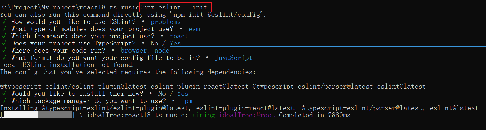

# 我的项目

项目相关说明。

## 相关配置

### `@路径重定向`

使用`@`符号，定位至`src/`目录下。

这里用到一个第三方包`craco`。

```shell
npm i @craco/craco@alpha -D
```

创建craco.config.js配置文件(根目录)

```js
const path = require('path')

const resolve = (dir) => path.resolve(__dirname, dir)

module.exports = {
  webpack: {
    alias: {
      '@': resolve('src')
    }
  }
}
```

配置config.json

```json
"baseUrl": ".",
"paths": {
    "@/*": [
        "src/*"
    ]
}
```

修改package.json

```json
"scripts": {
    "start": "craco start",
    "build": "craco build",
    "test": "craco test",
    "eject": "react-scripts eject"
},
```

### `Prettier格式化配置`

我们可以安装 `prettier` 第三方包，也可以使用 prettier 插件(vscode中)

创建一个.prettierrc文件配置规则。

```json
{
    "printWidth": 100, // 指定代码长度，超出换行
    "tabWidth": 2, // tab 键的宽度
    "useTabs": false, // 不使用tab
    "semi": false, // 结尾加上分号
    "singleQuote": true, // 使用单引号
    "quoteProps": "as-needed", // 要求对象字面量属性是否使用引号包裹,(‘as-needed’: 没有特殊要求，禁止使用，'consistent': 保持一致 , preserve: 不限制，想用就用)
    "jsxSingleQuote": false, // jsx 语法中使用单引号
    "trailingComma": "es5", // 确保对象的最后一个属性后有逗号
    "bracketSpacing": true, // 大括号有空格 { name: 'rose' }
    "jsxBracketSameLine": false, // 在多行JSX元素的最后一行追加 >
    "arrowParens": "always", // 箭头函数，单个参数添加括号
    "requirePragma": false, // 是否严格按照文件顶部的特殊注释格式化代码
    "insertPragma": false, // 是否在格式化的文件顶部插入Pragma标记，以表明该文件被prettier格式化过了
    "proseWrap": "preserve", // 按照文件原样折行
    "htmlWhitespaceSensitivity": "ignore", // html文件的空格敏感度，控制空格是否影响布局
    "endOfLine": "auto" // 结尾是 \n \r \n\r auto
}
```

此时，无需安装第三方，当我们安装了prettier插件，自动根据.prettierrc格式化。

批量格式化：使用 `npm run prettier` 命令，格式化所有文件。

修改package.json

```json
"scripts": {
    "start": "craco start",
    "build": "craco build",
    "test": "craco test",
    "eject": "react-scripts eject",
    "preitter": "preitter --write ." // 使用命令(preitter) 写(write) 所有文件(.) 需要安装第三方包
},
```

.preitterignore 格式化忽略文件

```json
/build/
.local
.output.js
/node_modules/**

**/*.svg
**/*.sh

/public/*
```


### `Eslint配置`

```shell
npx eslint --init
```



添加新规则.eslint.js

```js
module.exports = {
    "env": {
        "browser": true,
        "es2021": true,
        "node": true
    },
    "extends": [
        "eslint:recommended",
        "plugin:@typescript-eslint/recommended",
        "plugin:react/recommended"
    ],
    "parser": "@typescript-eslint/parser",
    "parserOptions": {
        "ecmaVersion": "latest",
        "sourceType": "module"
    },
    "plugins": [
        "@typescript-eslint",
        "react"
    ],
    "rules": {
        "@typescript-eslint/no-var-requires": "off" // 关闭require检测
    }
}
```

检测prettier规范

```shell
npm install eslint-plugin-prettier eslint-config-prettier -D
```

添加插件规范

```
'plugin:prettier/recommended'
```


### `Git命令`

- git push推送不了？

  > 将https协议改为git

  ```shell
  git remote set-url origin git@github.com:<username>/<仓库名称>.git
  ```

  ​


## 目录结构

- assets
  - css
  - img
  - data
- base-ui
- components
- hooks
- router
- store
- service
- utils
- views

test: git & github 


